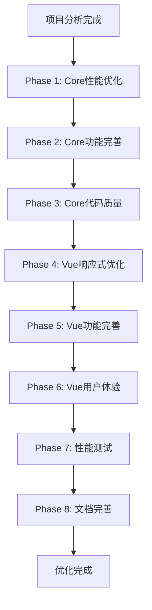
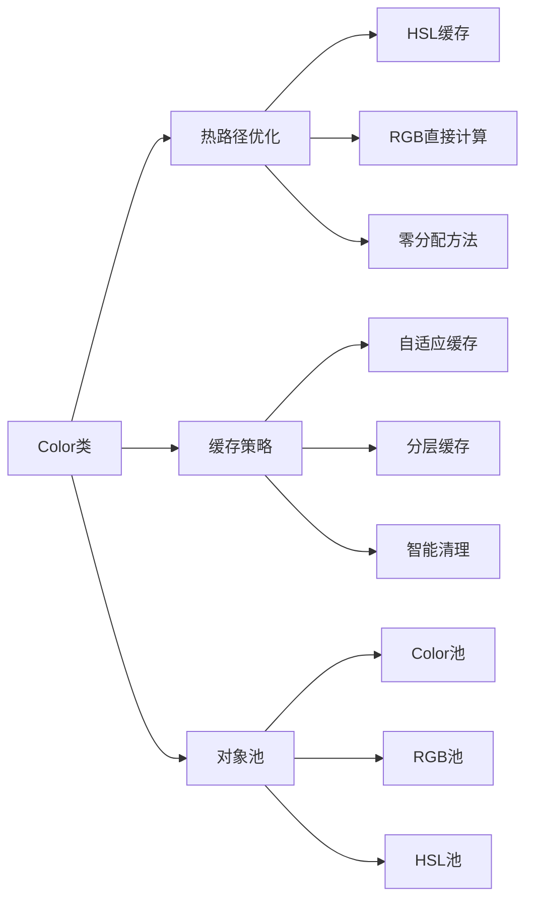
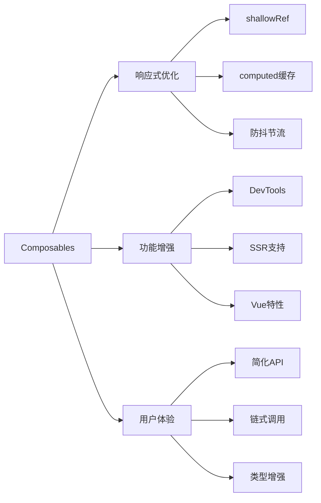
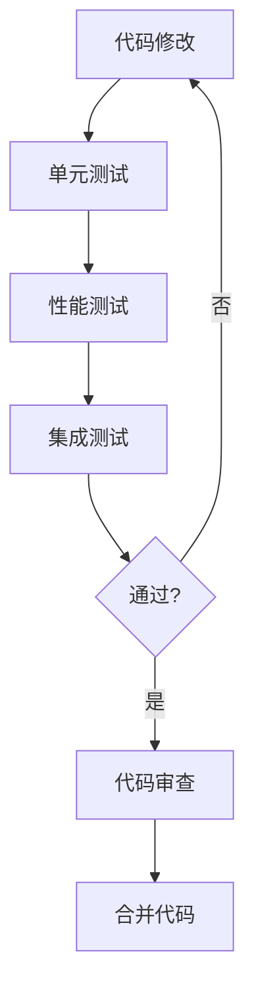

# 🏗️ 优化架构设计

## 系统架构优化流程

## Core包优化架构

## Vue包优化架构

## 性能优化重点

### 1. 内存优化
- 减少对象分配
- 优化缓存大小
- 改进对象池策略

### 2. 计算优化
- 缓存昂贵计算
- 使用位运算
- 避免重复转换

### 3. 响应式优化
- 细粒度更新
- 按需计算
- 防抖处理

## 关键性能指标

| 指标 | 当前值 | 目标值 | 提升幅度 |
|------|--------|--------|----------|
| Color创建 | 基准 | +30% | 🚀 |
| toHSL转换 | 基准 | +40% | 🚀 |
| 内存占用 | 基准 | -20% | ⬇️ |
| 缓存命中率 | ~50% | 70%+ | ⬆️ |

## 实施优先级

**P0 - 关键性能优化**
- Color类HSL缓存
- 智能缓存策略
- Vue响应式优化

**P1 - 重要功能完善**
- 高级插值算法
- 颜色科学功能
- Vue DevTools集成

**P2 - 质量提升**
- 错误处理增强
- 类型安全改进
- 文档完善

## 风险评估

### 低风险 ✅
- HSL缓存添加
- 新功能添加
- 文档更新

### 中风险 ⚠️
- 缓存策略修改
- 响应式重构

### 缓解措施
- 完整的单元测试
- 性能基准对比
- 渐进式部署
- 保持向后兼容

## 测试策略

## 成功标准

### 性能提升 ✅
- [x] 分析完成
- [ ] Color类优化完成
- [ ] 缓存优化完成
- [ ] Vue响应式优化完成
- [ ] 性能测试通过

### 功能完善 ✨
- [ ] 15+新功能实现
- [ ] 测试覆盖率>85%
- [ ] 零breaking changes

### 用户体验 🎯
- [ ] API调用减少30%
- [ ] 文档完整度>90%
- [ ] 示例代码更新

## 后续维护

### 持续优化
- 定期性能审查
- 用户反馈收集
- 新功能规划

### 技术债务
- 定期重构
- 代码清理
- 依赖更新